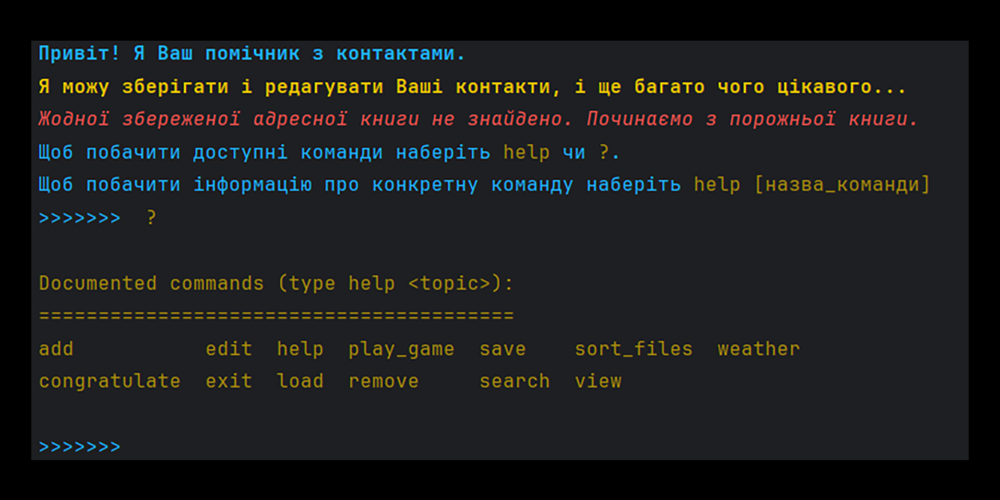

# dream_9_bot

Персональна книга контактів dream_9_bot

## Огляд

Книга контактів dream_9_bot - це простий додаток з інтерфейсом командного рядка (CLI), написаний на мові Python. Вона дозволяє користувачам керувати особистою адресною книгою, виконувати різні операції над контактами, позначати контакти специфічними тегами для зручного пошуку, сортувати файли за вказаним шляхом на ПК, і навіть перевіряти погоду для вказаного міста.

### Можливості

1. Додавання контактів: Легко додавайте нові контакти до вашої адресної книги з такими даними, як: ім'я, країна, номери телефонів, дата народження, електронна пошта, нотатки і теги до контакту.
2. Пошук контактів: Виконуйте пошук за різними категоріями, такими як: ім'я, країна, телефони, день народження, електронна пошта, нотатки і теги.
3. Редагування контактів: Зміна існуючої контактної інформації, включаючи ім'я, країну, телефони, день народження, електронну пошту, нотатки і теги.
4. Видалення контактів: Видалення контактів, вказавши ім'я або номер телефону.
5. Зберегти та завантажити: збереження адресної книги у файл або завантаження її з файлу для зручного зберігання даних.
6. Перегляд контактів: Відображення всіх контактів у табличному форматі, що полегшує перегляд і керування адресною книгою.
7. Інформація про погоду: Перевірте поточну погоду для вказаного міста за допомогою OpenWeatherMap API.
8. Привітання контактів: Перевіряйте кого з контактів необхідно буде привітати в поточному тижні.
9. Сортування файлів: Сортування файлів в папці, по вказаному шляху на комп'ютері.
10. Гра: Зіграйте з комп'ютером в гру числа. Необхідно вгадати число від 1 до 100 яке загадав комп'ютер.

### Використання

1. Всі необхідні залежності вказано в файлі віртуального середовища poetry: pyproject.toml.
2. Запуск програми відбувається, виконанням наступної команди: python main.py
3. Використовуйте наступні команди в dream_9_bot:
   * 'help': Вивести список доступних команд.
   * 'add': Додати новий контакт.
   * 'search': Пошук контактів за вказаними критеріями.
   * 'edit': редагування наявної контактної інформації.
   * 'remove': Видалити контакт.
   * 'save': Зберегти адресну книгу у файл.
   * 'load': Завантажити адресну книгу з файлу.
   * 'congratulate': Перевірити у кого з контактів скоро день народження.
   * 'view': Переглянути всі контакти в табличному форматі.
   * 'weather': Отримати погоду для вказаного міста.
   * 'sort_files': Відсортувати файли в папці, по вказаному шляху.
   * 'play_game': Зіграти в гру числа з комп'ютером.
4. Вихід: щоб вийти з програми, скористайтеся командою exit.

### Функція погоди

#### Огляд

Книга контактів dream_9_bot містить функцію погоди, яка дозволяє перевірити погоду для певного міста.
Скористайтеся командою weather, за якою слідує назва міста, або вам буде запропоновано ввести назву міста під час виконання команди.
Примітка: Переконайтеся, що у вас є дійсний ключ API для функції погоди. Замініть у скрипті заповнювач api_key на ваш дійсний ключ API: api_key = 'your_openweathermap_api_key'

### Функція сортування файлів

#### Огляд

Функція сортування файлів призначена для сортування різних типів файлів у папки згідно їхнього формату в межах каталогу, вказаного користувачем.
Для запуску сортування необхідно ввести команду sort_files і через пробіл вказати повний шлях до папки в якій необхідно відсортувати файли.
Нижче наведено опис розподілу файлів за їхнім форматом:

Зображення
1. JPEG: Файли у форматі JPEG сортуються у папку images/JPEG.
2. PNG: Файли у форматі PNG сортуються у папку images/PNG.
3. JPG: Файли у форматі JPG сортуються у папку images/JPG.
4. SVG: Файли у форматі SVG сортуються у папку images/SVG.

Відео
1. AVI: Відеофайли у форматі AVI сортуються у папку video/AVI.
2. MP4: Відеофайли у форматі MP4 сортуються у папку video/MP4.
3. MOV: Відеофайли у форматі MOV сортуються у папку video/MOV.
4. MKV: Відеофайли у форматі MKV сортуються у папку video/MKV.

Документи
1. DOC: Документи у форматі DOC сортуються у папку documents/DOC.
2. DOCX: Документи у форматі DOCX сортуються у папку documents/DOCX.
3. TXT: Текстові документи сортуються у папку documents/TXT.
4. PDF: Файли у форматі PDF сортуються у папку documents/PDF.
5. XLSX: Електронні таблиці у форматі XLSX сортуються у папку documents/XLSX.
6. PPTX: Презентації у форматі PPTX сортуються у папку documents/PPTX.

Аудіо
1. MP3: Аудіофайли у форматі MP3 сортуються у папку audio/MP3.
2. OGG: Аудіофайли у форматі OGG сортуються у папку audio/OGG.
3. WAV: Аудіофайли у форматі WAV сортуються у папку audio/WAV.
4. AMR: Аудіофайли у форматі AMR сортуються у папку audio/AMR.

Інші
1. Файли, які не відповідають жодному зазначеному формату, сортуються у папку OTHER.

Архіви
1. Архівні файли сортуються у папку archives/ARCHIVES. 

Після сортування порожні папки видаляються для підтримки чистоти та організації в каталозі. Якщо виникають проблеми з видаленням папок, виводиться відповідне повідомлення про помилку.

## Наша Команда:
* Developer: [chAek](https://github.com/aektann89)
* Developer: [Andrew](https://github.com/Andrewchv)
* Developer: [Aryna Reutska](https://github.com/xrendezvous)
* Scrum Muster + Developer: [Olha](https://github.com/HelgaTsar)
* Team Lead + Repository Owner + Developer: [Serg](https://github.com/CodeCraftSerg)